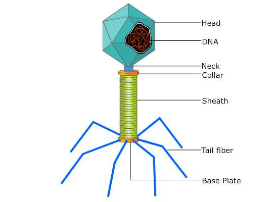

### Principle:
 
Bacteriophages (phage) are obligate intracellular parasites. They multiply inside a bacterium by making use of some or all of the host (ie., bacteria)  biosynthetic machinery (viruses that infect bacteria are known as bacteriophage). They enter the bacterial cell by ‘landing’ on the cell wall and injecting their DNA into the bacterial cytoplasm. After entry, the phage DNA acts as a template for production of phage proteins. These proteins replicate the phage and subjugate the cell, eventually causing lysis and death of the host cell.  A bacteriophage particle is even harder to see than a bacterium. Viruses are beyond the limits of resolution of the light microscope and can be seen only with electron microscopes. Fortunately, we can use a technique very similar to the colony-counting technique used to measure the number of bacteria to count phage particles, known as the plaque assay. Lytic phages are enumerated by this method.

&nbsp;

Fig:- A typical phage

 
&nbsp;

The plaque assay is originally a virological assay employed to count and measure the infectivity level of the bacteriophages. But later, it was applied to measure and count the mammalian viruses as well. This assay is the most widely used technique for the isolation of virus and its purification, and to optimize the viral titers. The basis of plaque assay is to measure the ability of a single infectious virus to form a “plaque” on a concurrent monolayer culture cells. A plaque is developed as a part of infection of one cell by a single virus particle that is followed by the replication of that virus, and finally, the death of the cell. The newly replicated virus particles will later infect and then kill surrounding cells.

 
&nbsp;

For this technique, we will be provided with a virulent phage stock and a susceptible host cell culture. 10-fold dilutions of the phage stock are prepared. The procedure requires the use of a Double-Layer Agar (DLA) technique also known as double agar overlay method, in which the hard agar serves as a base layer (to form gel), and a mixture of few phage particles (diluted stock) and a very large number of host cells in a soft agar forms the upper overlay. When the plates are incubated, susceptible Escheria coli cells multiply rapidly and produce a lawn of confluent growth on the medium. When one phage particle adsorbs to a susceptible cell, penetrates the cell, replicates and release new phage particles which infect other bacteria in the vicinity of the initial host cell. The growth or spread of the new viruses is then restricted or limited to the neighbouring cells by the gel. This cycle is repeated until large numbers of bacteria have been destroyed. The destroyed cells produce single circular, non turbid areas called plaques in the bacterial lawn, where there is no growth of bacteria because the phage progeny originating from single virus particles have multiplied sufficiently to kill bacteria over an easily visible area.  Eventually the plaque becomes too large to be visible to our naked eye. Each plaque represents the lysis of a phage-infected bacterial culture and can be designated as a plaque-forming unit (PFU) and is used to quantitate the number of infective phage particles in the culture.  Dyes that stain the living cells are frequently used to enhance the contrast between the plaques and the living cells. Therefore the dead cells in the plaque will appear as unstained against the colored background. Only viruses that have the ability to cause visible damage of cells can be assayed using this way.

&nbsp;

 

The number of phage particles contained in the original stock phage culture is determined by counting the number of plaques formed on the seeded agar plate and multiplying this by the dilution factor. For a valid phage count, the number of plaques per plate should not exceed 300 nor be less than 30. Plates showing greater than 300 PFUs are too numerous to count (TNTC); plates showing fewer than 30 PFUs are too few to count (TFTC).

 
&nbsp;

The main difference between Plaque Assay and Colony-Counting is that, to count bacteria, we spread about 100 - 400 bacteria over the surface of the agar and incubate the plate. To count phage, we spread 100 - 400 phage particles mixed with a very large number of host bacterial cells over the surface of the agar and incubate the plate. In colony-counting, we directly observe the accumulation of large numbers of bacteria, each pile being a colony. In plaque formation, we directly observe the absence of bacteria against a background of dense bacterial growth, each zone of destruction being a phage plaque (hole) in the lawn of bacteria. Each hole represents one phage in the sample applied to the plate.

 
&nbsp;
