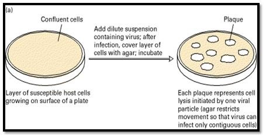
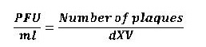
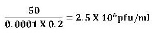

### Materials Required:
 
 &nbsp;
 
#### Cultures:
 

24- hour nutrient broth cultures of Escheria coli B and T2 coli phage.

 
&nbsp;
  

#### Media:
 

Tryptone agar plates, Tryptone soft agar tubes (2ml/tube) and tryptone broth tubes (9ml/tube)

 
 &nbsp;
  

#### Equipments:
 

Bunsen burner

Water bath

Thermometer

1-ml sterile pipettes

Sterile Pasteur pipettes

Mechanical pipetting devices

Test tube rack

Glassware marking pencil
 
 
&nbsp;
 
 
### Media Preparation:
 

a)    Tryptone agar:-
Add 10g Tryptone, 0.01-0.03M Calcium chloride (reagent), 5g Sodium chloride and 11g agar in 1L of water. Heat with frequent agitation and boil for 1 minute to completely dissolve the powder. Autoclave at 121°C for 15 minutes.

b)    Tryptone Broth:-
Prepared as above without the addition of agar in the medium.

c)    Tryptone soft agar:-
Add 10g Tryptone, 5ml Potassium chloride and 9g Agar in 1L of water. Heat with frequent agitation and boil for 1 minute to completely dissolve the powder. Autoclave at 121°C for 15 minutes.

 
 
 &nbsp;
 
## Procedure:
 

Since viruses can grow to incredibly high concentrations, we need to dilute them in order to count them effectively. Perform dilution of the bacteriophage culture .
Label all dilution tubes and media as follows. Each tube represents a ten-fold dilution of the virus

a)    Five tryptone soft agar tubes   : 10-5, 10-6, 10-7, 10-8, 10-9

b)    Five tryptone hard agar plates : 10-5, 10-6, 10-7, 10-8, 10-9

c)    Ten tryptone broth tubes          : 10-1 through 10-10

 
 
 &nbsp;
 
### Serial Dilution
 

Put on gloves, fill 9 ml of tryptone broth to ten culture tubes labeled as 10-1 through 10-10. These tubes will be used for viral serial dilutions.
Take 1 ml of the phage culture stock that you want to titer and transfer it to the tube titled 10-1 with a pipette. Mix the tube well. This is your first ten-fold dilution.(ie; a 1 in 10 dilution)
 
 &nbsp;
 
Take 1 ml of the mixed culture from your tube labeled 10-1 and transfer it with a new pipette to the next tube, labeled 10-2 . Mix this tube as well.
Continue this pattern to create a serial dilution series. You will end up with 9 tubes of 9 ml and 1 tube of 10 ml. The viral loads in your tubes will be diluted anywhere from 10 times (your first tube) or 100 times (your second tube) to ten billion times (your final tube).
 
 
 &nbsp;
 
### Preparing Plates
 

. Take five tubes of tryptone soft agar and five Petri plates labeled as 10-5 through 10-9

. Place the five labeled soft tryptone agar tubes into a water bath. Water should be of a depth just slightly above that of the agar in the tubes. Bring the water bath to 100˚C to melt the agar. Cool and maintain the melted agar at 45˚C. This will ensure that your agar does not solidify in the tubes before you have a chance to pour it into the petri dishes.

. Aseptically transfer two drops of Escheria coli B culture with a Pasteur pipette to the agar and mix it gently. These are the bacteria that will be killed, allowing you to count the number of virus particles in a particular solution.

. Add 0.1 ml of each serial dilution to its corresponding soft agar tube while the tubes are still in the hot water bath. For example, 0.1 ml of your 10-5 serial dilution should go into the soft agar tube labeled 10-5.

. Using separate Pasteur pipettes and sterile pipette tips, repeat the previous step for the tryptone broth phage dilution tubes labeled 10-6 through 10-9.

. Mix the tubes well and then pour each tube into the Petri plate with the corresponding label. This will create a thin layer of agar that has been inoculated with bacteria and viruses in each plate. Incubate all plate cultures in an inverted position for 24 hours at 37 ˚C

### Counting and Calculating Titers
 

The viral titer is a quantitative measurement of the biological activity of  your virus and is expressed as plaque forming units (pfu) per ml.
To calculate the viral titer,

. Take your plates out of the incubator and examine them. You should see cloudy areas throughout the plate where bacteria have grown, except for small clear spots called plaques. These plaques are patches of dead bacteria, and each plaque represents one virus.

. Find a plate that has between 30 and 300 plaques and count the exact    number of plaques on that plate.

. Then use the following formula to determine the titer (pfu/ml) of your viral stock.
 
 

Where,   d = dilution ; v = volume of diluted virus added to the plate
 

 &nbsp;
  

### Sample calculation:

•    An average of 50 plaques formed in the 1:10,000 dilution wells

•    Volume of diluted virus added: 0.2 ml
 
 
